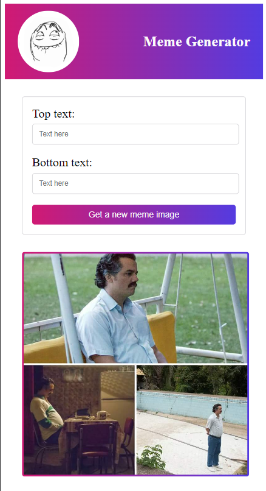
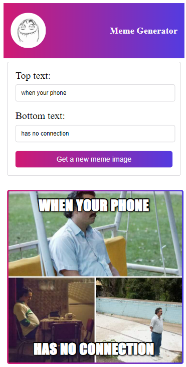

# Meme Generator Project

This repository contains a Meme Generator project built with React. 

The project allows users to generate memes by adding custom text to randomly fetched images from the Imgflip API.

Check out the project [Live Site](https://silviasaverino.github.io/react-meme-generator/)

## App.js
This file serves as the main entry point of the React application. It imports and renders the Header and Meme components.

## Meme.js
This file contains the main component of the Meme Generator project. It includes functionality for fetching images from the Imgflip API, handling user input for adding custom text, and rendering memes dynamically.

### State Management: 
The component uses React's useState hook to manage state variables. It maintains the state for meme, which includes topText, bottomText, and randomImage, as well as allMemeData to store fetched meme data.

### Data Fetching: 
The useEffect hook is utilized to fetch meme data from the Imgflip API when the component mounts. This data is then stored in the allMemeData state variable.

### Random Meme Generation: 
The GetMemeImageBtn function is called when the user clicks the "Get a new meme image" button. It randomly selects a meme image URL from the fetched data and updates the meme state with the new image URL.

### Form Handling: 
The handleFormDataChange function updates the meme state with the user input for top and bottom text fields as they type.

### Rendering: 
The component renders a form where users can input custom text for the meme, a button to generate a new meme image, and the generated meme image with the user-added text overlays.

## Header.js
This file contains the header component of the Meme Generator project. It renders a header with the logo and title of the application.

## CSS Styling
The CSS styling is applied using CSS modules, ensuring that styles are scoped to their respective components.
The styling includes responsive design features, such as media queries, to ensure the application looks good on various screen sizes.

